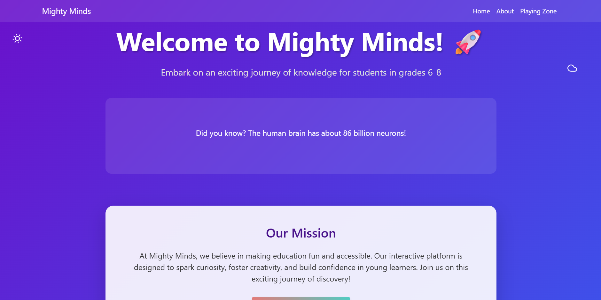
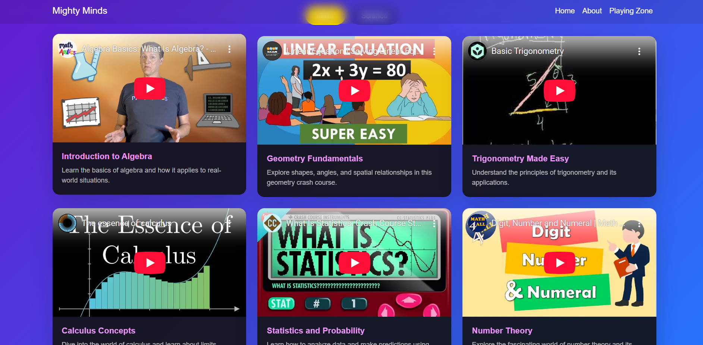
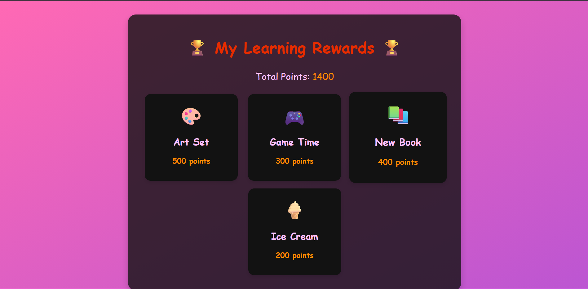
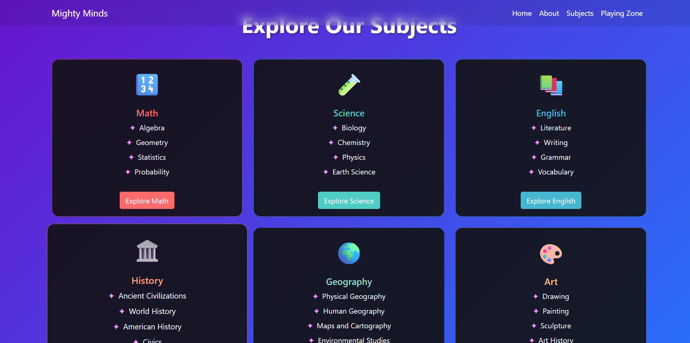
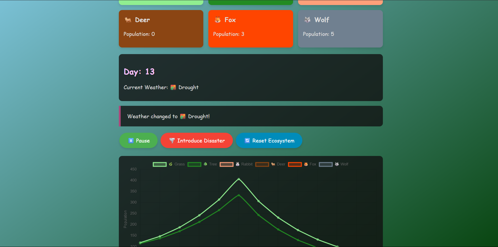

# 🎓 Mighty Minds

**Mighty Minds** is an interactive learning platform designed to make education fun, engaging, and effective for students of **classes 6 to 8**. The platform transforms traditional textbook concepts into immersive mini-games, enabling students to **learn by playing**.

## 🧠 What's It About?

This project offers a **gamified educational experience** that helps middle school students grasp key concepts in subjects like **Math**, **Science**, and **EVS**. Instead of passive reading, students actively interact with animations, challenges, and visual feedback — making learning feel more like an adventure than a task.

## 🎯 Target Audience

- Students in **grades 6 to 8**
- Schools seeking innovative teaching tools
- Parents looking for educational activities that engage their children

## 🚀 Problem We Solve

Many students lose interest in core subjects due to rote learning and boring presentations. Mighty Minds addresses this by:

- Providing **interactive visual games** aligned with curriculum topics
- Boosting **conceptual clarity** through gameplay mechanics
- Making learning **accessible and fun**, even for struggling learners

## 📸 Screenshots

---
